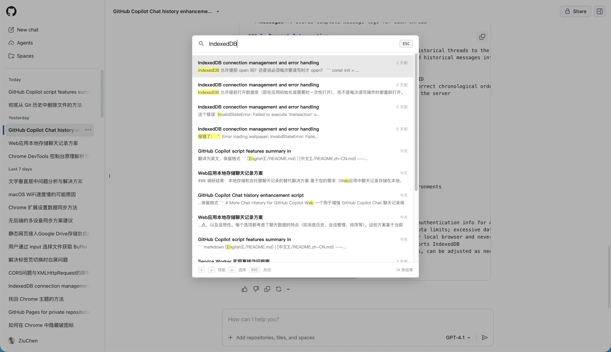

[English](./README.md) | [中文](./README.zh-CN.md)

----

# Github Copilot Enhanced

A UserScript for enhancing GitHub Copilot (Web).

> [!WARNING]  
> Please note, this script is not an official product. Make sure you understand how it works and the potential risks before using.
> 
> All data is stored only in your local browser and will not be uploaded to any server.

## Feature Highlights

### 🗄️ Long-Term Storage
By default, GitHub Copilot (Web) only retains chat history for 30 days.
This script enables longer chat history retention by saving conversations to the browser's IndexedDB.

## 🔍 Search Functionality
- **Shortcut Open**: Press `Ctrl/Cmd+K` to quickly open the search panel
- **Live Search**: Shows matching chat records in real time as you type keywords, supports fuzzy search
- **Keyboard Navigation**: Use arrow keys to browse search results, press Enter to open the selected conversation

### 🔄 Auto Sync
- **Periodic Sync**: Automatically syncs all chat history every 30 minutes
- **Initial Load**: Executes one sync immediately when the page loads
- **Background Operation**: Sync runs in the background without affecting normal usage

### 🔌 Seamless Integration
- **Request Interception**: Automatically intercepts GitHub Copilot API requests
- **Data Merging**: Merges local history with server data before returning
- **Transparent Operation**: Completely transparent to the user, no extra actions required

## Usage

### Installation
1. Install Tampermonkey or another UserScript manager
2. [Click here to install](./index.user.js) the script

## Notes

1. **Authentication Issues**: The project uses your browser's existing authentication info for API requests. Make sure you are logged into GitHub and have Copilot Pro or higher access
2. **Storage Limitations**: IndexedDB is subject to browser storage quotas; too much data may cause storage failures
3. **Privacy & Security**: All data is stored only in your local browser and will not be uploaded to any server
4. **Compatibility**: Requires a modern browser that supports IndexedDB
5. **Sync Frequency**: Default is to sync every 30 minutes, can be adjusted as needed
